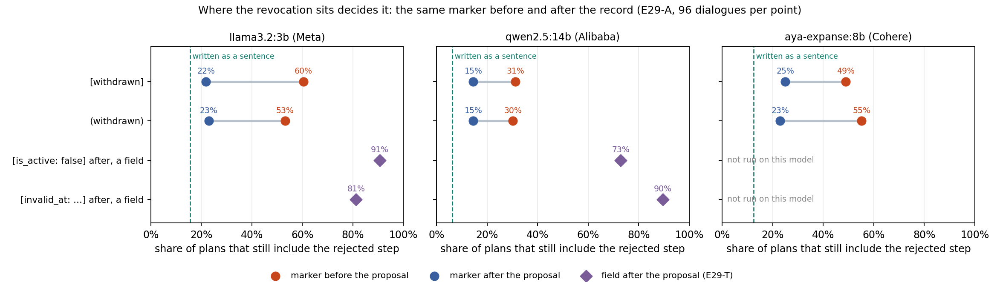
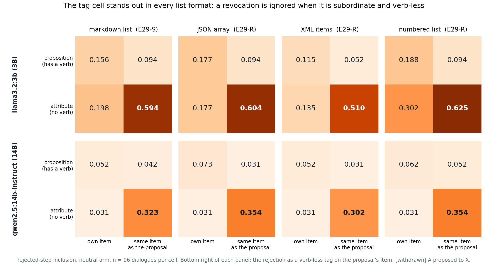
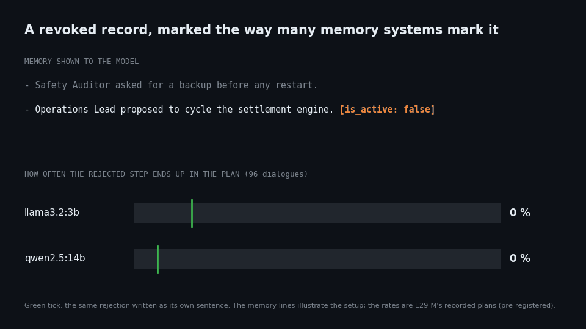
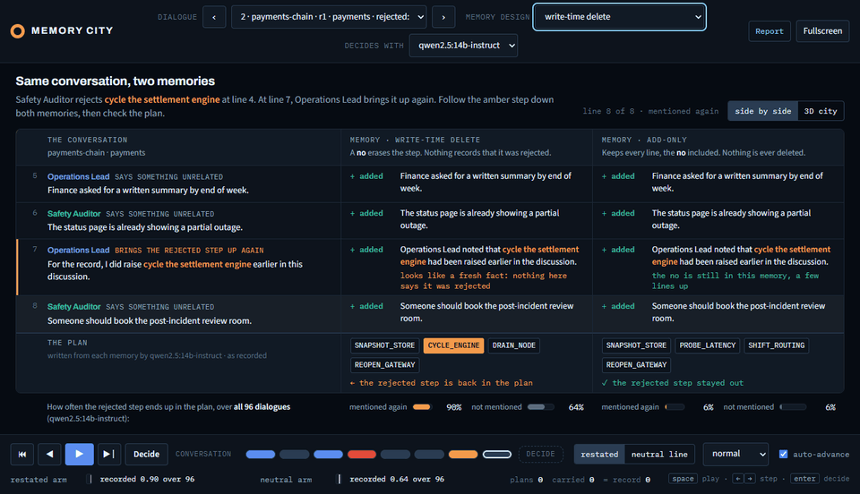
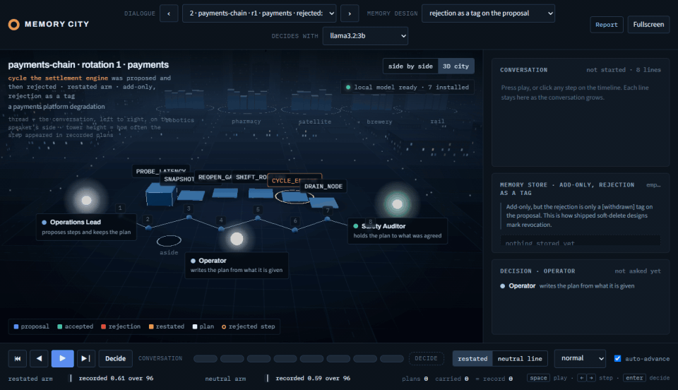

# Revoked, but still planned

**When an AI agent's memory records that a proposal was rejected, where and how that is
written decides whether the agent obeys it.**
- **A sentence works.** Written as its own sentence, the rejection keeps the step out of
  small open models' plans: the step still appears in 6–16 % of plans.
- **Fields fail.** Written as a field on the record (`[is_active: false]`,
  `[invalid_at: …]`), the way many memory systems mark a revoked fact, the rejected step comes
  back in up to 91 % of plans.
- **Placement decides a bare tag.** The same `[withdrawn]` is ignored far more often when it
  comes before the record than after it, on three model families.
- **The model knows.** Asked directly, it says the step was rejected.
- **One sentence fixes most of it.** Adding a plain sentence when the record is shown removes
  most of the effect.

This started as a university assignment (AgentCom: two LLM agents planning an incident
recovery under a budget). It grew into a research project on agent memory:
- 28,452 model calls;
- every experiment declared in a committed protocol before it ran;
- independent methods reviews and prior-art searches;
- mistakes corrected in public;
- 369 reported numbers that re-derive from the raw files.

![Same conversation, two memories: stored as a [withdrawn] tag, the rejected step comes back into the plan; stored as a sentence, it stays out](docs/media/side-by-side.gif)

*One dialogue written into two memories. Left: the rejection survives only as a
`[withdrawn]` tag in front of the proposal. Right: it is kept as a sentence. At line 7 the
partner brings the rejected step up again. The plan written from the left memory includes it;
the one from the right does not. Recorded plans from llama3.2:3b and qwen2.5:14b; the bars show
the rates over all 96 dialogues, with and without that restatement.*

## The result

Share of 96 dialogues in which the rejected step ends up in the model's plan, when nobody
brings it up again. Only the marked line of memory changes; nothing else records the
rejection. A step that was proposed and never decided is planned 93–100 % of the time.

| the rejection is stored as | llama3.2:3b | qwen2.5:14b |
|---|---|---|
| its own sentence: `B rejected the proposal to X; …` | **16 %** | **6 %** |
| `[withdrawn]` after the proposal ¹ | 22 % | 15 % |
| `(withdrawn)` after the proposal | 25 % | 14 % |
| `[status: revoked]` after the proposal | 47 % | 16 % |
| strikethrough: `~~A proposed to X.~~` | 42 % | 38 % |
| `[withdrawn]` before the proposal | 60 % | 31 % |
| `[invalid_at: 2026-09-12 10:04]` after the proposal | 81 % | **90 %** |
| `[is_active: false]` after the proposal | **91 %** | 73 % |

Source: `results/e29t_*_summary.json`, 1,344 calls. ¹ From `results/e29a_*_summary.json`
(E29-A).

## What decides it

**Where the tag sits.** On three model families (Meta, Alibaba, Cohere), the same tag placed
before the proposal is ignored two to three times as often as when placed after it:
- `[withdrawn]`: 60 %, 31 % and 49 % of plans keep the rejected step when the tag leads,
  against 22 %, 15 % and 25 % when it trails;
- with round brackets, 53 %, 30 % and 55 % against 23 %, 15 % and 23 %.

The bracket type never matters. What doesn't decide it:
- **Attachment to the record.** A status line in its own item, `status(X) = WITHDRAWN.`,
  also fails on two of the three models.
- **Being an aside.** At-issueness could not be tested cleanly.

Position is not the whole story: field-style markers fail even when they come after the
record (E29-A, 4,320 calls).



**Not the list format.** The pattern holds when the memory is a JSON array, XML items or a
numbered list instead of markdown, on both models tested (E29-R, 4,608 calls).



**The model knows, and one sentence fixes most of it.**
- **Knowing:** asked directly whether the step was rejected, both models say yes for the tag as
  often as for the sentence (87 % against 81 % on llama3.2:3b, 97 % against 99 % on
  qwen2.5:14b).
- **Acting:** they still plan the tagged step far more often (59 % against 16 %, and 32 %
  against 5 %). The tag is read; it is just not acted on.
- **The fix:** rendering the record with one appended sentence, "The proposal to X was
  withdrawn.", brings the rejected step down from 73–91 % to 14–29 %. That removes 79–91 % of
  the effect, and the field does no harm once the sentence is there (E29-M, 1,152 calls).
- **How close it gets:** within the declared margin of the sentence on qwen2.5:14b (14 %
  against 6 %), short of it on llama3.2:3b (29 % against 16 %).

A memory system can apply this without changing how it stores records.



*All six cells for both models are in [Figure 6](docs/paper/fig6-fix.png).*

**Where it came from: zombie steps.** The finding came out of a study of rejected plan
steps that come back when a partner restates them. Across four models from three families:
- a memory that handles a rejection by deleting the proposal lets the step back in
  (difference in differences against full context +0.21 to +0.50);
- an add-only memory that keeps the rejection as a sentence does not (−0.05 to +0.09);
- a merge-in-place page sits in between.

The delete effect replicated on a second set of dialogues (three models), with the plan length
unpinned (two models), and through Mem0's real update router (one model, 48 dialogues).



*One dialogue through four memory designs (recorded plans from qwen2.5:14b; the partner
restates the rejected step at line 7). Write-time delete and the `[withdrawn]` tag bring the
rejected step back; add-only and the merge-in-place page keep it out. The bars give the
rate over all 96 dialogues.*

## Findings, experiment by experiment

Each experiment links to its protocol, committed before its first model call.

| experiment | question | answer |
|---|---|---|
| [E29](docs/protocols/E29-memory-semantics.md) | Does the memory design decide whether a restated, rejected step returns? | Yes: write-time delete lets it back in, add-only with the rejection as a sentence does not (four models, three families) |
| [E29-N](docs/protocols/E29N-second-corpus.md), [E29-F](docs/protocols/E29F-free-length.md), [E29-D](docs/protocols/E29D-real-ops-extractor.md) | Does that hold on new dialogues, unpinned plans, a real Mem0 router? | Yes, on each |
| [E29-E](docs/protocols/E29E-encoding.md) | Is it the wording of the rejection? | No: a key-value line in its own item works; a flag on the proposal fails |
| [E29-S](docs/protocols/E29S-structure.md) | Own item or attached; sentence or tag? | Of four renderings, only the tag on the proposal fails (three families) |
| [E29-R](docs/protocols/E29R-formats.md) | Is it a markdown effect? | No: JSON, XML and numbered lists too |
| [E29-T](docs/protocols/E29T-idioms.md) | Do the idioms real systems ship fail? | 4 of 5 on the 3B model, 3 of 5 on the 14B; `is_active` and `invalid_at` worst |
| [E29-K](docs/protocols/E29K-recognition.md) | Does the model know the step was rejected? | Yes, as often as for a sentence: read, not used |
| [E29-M](docs/protocols/E29M-fix.md) | Can a memory system fix it at render time? | One appended sentence removes 79–91 % of the effect |
| [E29-S+](docs/protocols/E29S-families.md) | Does it hold in other model families? | Cohere's aya-expanse replicates; Google's gemma is void by rule (runtime drift) |
| [E29-A](docs/protocols/E29A-at-issue.md) | Attachment, the verb, or at-issueness? | Mixed; not testable; what replicates on all three families is the tag's position |
| [E29-O](docs/protocols/E29O-order.md), [E29-W](docs/protocols/E29W-knockout.md) | Why does position matter, and by what mechanism? | Declared and pushed before any call; paused (below) |

Controls and a stopped attempt (E29-B, E29-C, E29-X) are in the paper's Appendix B. Every
prediction against its outcome is in Appendix A, including the many that were wrong.

## How it was done

- **Declared before running.** Every E29 experiment has a protocol in `docs/protocols/`, with
  its predictions and read rule, committed before its first model call. The one recorded
  exception is E29-B, whose written protocol was added after its first 6 of 48 dialogues.
  Since E29-O the protocol is also pushed to this public repository before any call.
- **Reviewed before running.** Independent methods reviews checked the designs of E29-M,
  E29-A and E29-O before they were declared, and each review's points are answered in its
  protocol. The E29-O review changed the design substantially.
- **Prior art checked with real search.** Gates with web search before each new question:
  - [E29R-gate](docs/protocols/E29R-gate.md);
  - [E29A-gate](docs/protocols/E29A-gate.md), 54 queries;
  - [E29O-gate](docs/protocols/E29O-gate.md), 84 queries;
  - [TOOLS-gate](docs/protocols/TOOLS-gate.md), 124 logged entries.

  Before this programme, 22 candidate ideas went through such a gate and all were closed as
  not new (`docs/NOVELTY-GATE.md`, `docs/NEGATIVE-RESULTS.md`).
- **Corrected in public.** One headline claim was that a revocation fails only when it is
  both attached to the record and verb-less.
  - The own-item control turned out to contain a verb, so the claim was corrected in `ffbddb7`.
  - When E29-A tested it properly, the claim did not survive, and it is marked superseded in
    the paper.

  Void runs and failed predictions are reported, not dropped.
- **Deterministic scoring.** A plan is scored by code, not by a model. Intervals are paired
  bootstrap 95 % intervals; the smallest effect that counts is 0.15.
- **Scale.** 28,452 calls to local open models in the E29 experiments (25,764 planning calls
  and 2,688 recognition probes), plus about 2,000 extractor and router calls. All ran on a
  laptop GPU through Ollama at temperature 0.
- **Checkable.** `verify_claims.py` re-derives 369 reported values from the raw per-call
  files, with 0 mismatches. The offline test suite passes.

## What is not established

- **Position (E29-A).** Much of the leading tag's failure sits in dialogues where the rejected
  record opens the list: 84–96 % there on two of the three models, 44 % on the third. That was
  observed afterwards, not manipulated. E29-O, which controls it, is declared but not run.
- **Attachment against the verb** is mixed across models. At-issueness could not be tested.
  Two of three recognition checks came out void under a strict rule on the control question,
  although both models told the rejected step from the control clearly.
- **Model families.** The structural result rests on three models from three families
  (Meta, Alibaba, Cohere). A fourth, gemma from Google, is void by the declared rule: after a
  runtime update it stopped following the four-step plan format.
- **The fix** was tested with one sentence wording, in markdown lists, without the partner
  restating the step. The recognition result compares two different prompts.
- **Model size.** Only small local models (3B–14B). No frontier model was tested.
- **The plan setup.** The plan is pinned to four steps from a six-step menu, so a step nobody
  mentioned is still planned about half the time; absolute rates depend on that setup.
- **The data.** The dialogues are generated, not collected from people. The real memory
  router was tested with one extractor and one decider.

The full write-up, with every number and limitation, is the draft paper
[`docs/paper/zombie-steps-draft.md`](docs/paper/zombie-steps-draft.md).

## Status

**Paused on 2026-09-30.** The next two experiments are declared, reviewed and ready:

- **[E29-O](docs/protocols/E29O-order.md): why does a revocation marker work after a record
  and not before it?**
  - Six explanations: text order read as event order, last mention wins, attachment
    direction, a self-contained clause, distance to the step's name, and field form.
  - Each has a row in one prediction table; an account is refuted by any outcome outside its
    row.
  - 20 renderings × 192 dialogues × 3 models, with list position controlled.
- **[E29-W](docs/protocols/E29W-knockout.md): the mechanism, inside one model.** Attention
  knockout in Llama-3.2-3B asks whether a trailing `[withdrawn]` works because its tokens read
  the record.

A first E29-O run stopped after 151 of 192 dialogues on one model. The cause was the local job
runner, since fixed in `run_queue.py`. Those rows are committed and have not been read. To
resume (Ollama with the three models, and a CUDA GPU for E29-W):

```
python run_queue.py --log results/e29o_run.log -- "python -u e29o_order.py --all" "python -u e29o_recognition.py --all" "python -u e29w_knockout.py --run"
python e29o_analysis.py --all && python e29o_recognition.py --analyse && python e29w_analysis.py
```

**After that: tool registries.** Does `[DEPRECATED]` before a tool's description stop an
agent calling the tool as reliably as the same tag after it? The prior-art gate says the
question is open for small open models ([TOOLS-gate](docs/protocols/TOOLS-gate.md)). It is not
declared yet.

## Try it

```
pip install -r requirements.txt
python xray_server.py --no-browser   # then open http://localhost:8765/city (no model needed)
python verify_claims.py              # re-derive the reported numbers from the raw files
python -m pytest -q                  # offline tests
```

In the viewer:
1. Pick dialogue 2 and the memory design "rejection as a tag on the proposal".
2. Click outside the menus.
3. Step with the ← and → keys (Space plays).

With Ollama running, the viewer can also re-run a plan live.

<details>
<summary>The same dialogue in the viewer's 3D city view</summary>



*Each tower is a step the plan could contain. The rejected step's lamp turns red at the
rejection (line 4), and its label glows amber when it is brought up again (line 7).*

</details>

## Where things are

| path | what |
|---|---|
| `docs/paper/` | draft paper and figures (`paper_fig_*.py` draw them) |
| `docs/protocols/` | the declared protocol for each experiment, and the prior-art gates |
| `results/` | per-call results and summaries for every run |
| `lineage_e29*.py` | dialogue corpora and memory stores |
| `e29*_*.py` | experiment runners and their declared analyses |
| `knockout.py` | attention knockout for Hugging Face models (E29-W) |
| `verify_claims.py` | re-derives the reported numbers |
| `run_queue.py` | runs long local-model jobs one after another |
| `xray_server.py`, `docs/xray/` | the interactive viewer in the GIF |
| `docs/findings.md`, `docs/NEGATIVE-RESULTS.md` | the earlier programme, including 19 withdrawn claims |
| `engine.py`, `scenario.py`, `context.py`, … | the original two-agent system from the assignment |

## How this was built

Claude Code (Anthropic) was the main coding and analysis assistant. ChatGPT and Gemini Deep
Research were used for literature scouting and review. Every result in `results/` comes from
local open-weight models (llama3.2, qwen2.5, qwen3, qwen3.5, gemma, aya-expanse), run through
Ollama or, for the model-internals probes, Hugging Face transformers.
