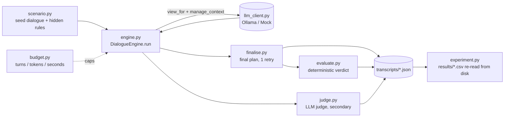
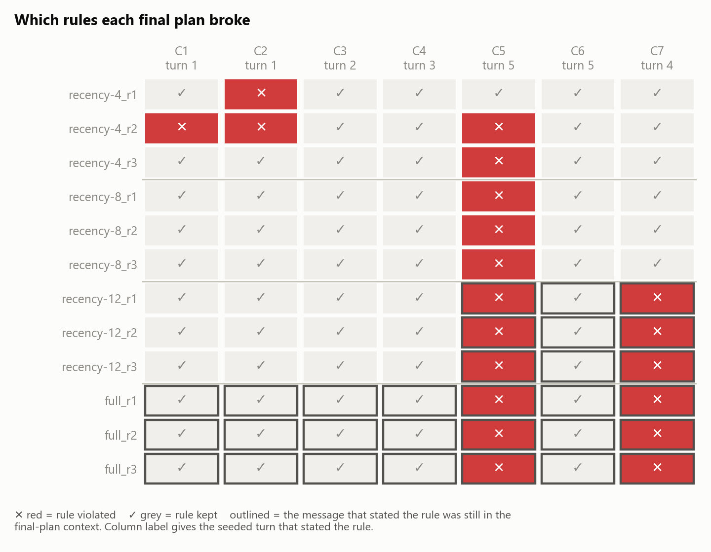
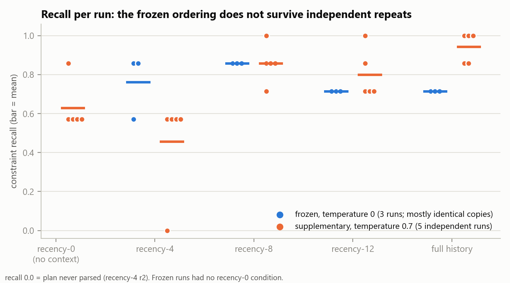
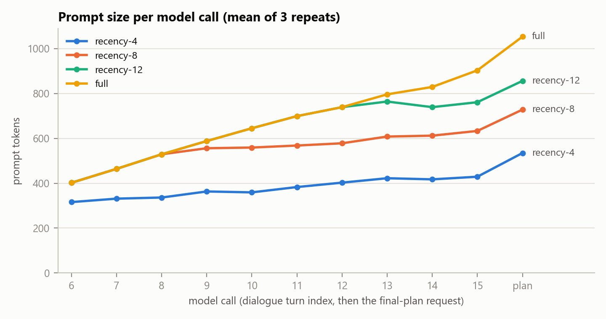

# Two agents, one incident: does context management decide whether rules survive?

KIUA2003/KIUA2005 AgentCom compulsory. Branch `core-frozen`; the experiment evidence
is frozen at tag `compulsory-baseline-v1`.

## 1. Summary

I built a bounded two-agent dialogue system in plain Python on a local model
(`llama3.2:3b` via Ollama). An Operations Lead and a Safety Auditor plan the recovery
from a production incident. Seven operational rules are stated early in the
conversation. At the end, the Operations Lead writes the plan as JSON, and a
deterministic evaluator checks it against those rules.

The experiment varies one thing: how many recent messages each agent sees (4, 8 or
12), with full history as a ceiling.

- **Frozen experiment** (temperature 0, 3 repeats): no run succeeded. Recall did not
  rise with context: 8 messages scored best (0.857) and full history tied for worst
  (0.714). Analysis showed that at temperature 0 the repeats were mostly **identical
  copies**, so the 12 runs were only 6 independent observations.
- **Supplementary run** (temperature 0.7, 5 independent repeats, declared in advance):
  full history is **best** (recall 0.943, 3/5 perfect plans), recency-4 is worst (0.457),
  and a no-context floor scores 0.629. The frozen ordering does not generalise.
- **What holds in both:**
  - The earliest-stated rules are the ones a small window loses (C1/C2: 4/5 recency-4
    runs, 0/5 full history).
  - One ordering rule (C5) breaks at a similar rate whatever the context. It even
    broke when the rules were placed in the system prompt.
  - The LLM judge carried no useful signal: it never judged a correct plan as a success.
- **Intentional failure analysis** (15 cases): every guard worked. It also exposed one
  real weakness: Ollama **silently truncates** a prompt that exceeds its context size,
  turning "full history" into an unlogged recency window.

## 2. Scenario and why it was chosen

My Week 1 scenario was a debate about AI in university education. I replaced it,
because **a debate cannot measure memory**. Two agents can argue for twenty turns
without ever needing anything from turn two, so every context strategy would score
the same.

The replacement is an incident where forgetting has a consequence a program can
detect. The payments database on node `db-04` is failing, and two colleagues plan the
recovery.

- **Agent A, Operations Lead:** produces the recovery plan and keeps track of what
  was agreed.
- **Agent B, Safety Auditor:** challenges unsafe actions and holds the plan to the
  rules already raised, without inventing new ones.

The conversation opens with six scripted turns (the *seed*) in which the two
colleagues state seven rules in natural language. For example:

> **Safety Auditor:** "Before anything else, that node has to be isolated [...] And do
> not run diagnostics on it until the node is isolated."

| id | rule | stated at turn |
|---|---|---|
| C1 | `ISOLATE_NODE` is required | 1 |
| C2 | `ISOLATE_NODE` before `RUN_DIAGNOSTICS` | 1 |
| C3 | `RUN_BACKUP` is required | 2 |
| C4 | `RUN_BACKUP` before `RESTART_DB` | 3 |
| C5 | `FAILOVER_API` before `RESTART_DB` | 5 |
| C6 | `RESTART_DB` before `RESTORE_TRAFFIC` | 5 |
| C7 | `RESTORE_TRAFFIC` is required | 4 |

Two design rules make the experiment meaningful:

1. **No rule is ever in a system prompt**, and a test enforces this. The system prompt
   survives every context policy by construction, so a rule placed there could never be
   forgotten, and the experiment would measure nothing.
2. **The agents see natural language; only the scorer sees rules.** The action
   identifiers appear in exactly one place, the final-plan instruction. A test checks
   that each rule's source sentence really appears in the turn it claims.

**Goal reached** means the final plan parses, is declared `ready`, and violates none of
the seven rules (`constraint_recall == 1.0`).

## 3. System architecture



| part | file | what it does |
|---|---|---|
| Agent | `agents.py` | name, system prompt, model, temperature. No behaviour of its own |
| Transcript | `engine.py` `Entry` | one neutral list of who said what, with prompt tokens, completion tokens and seconds for every message |
| Role mapping | `engine.py` `view_for` | builds one agent's view of the transcript. The same message is `assistant` in its author's view and `user` in the other agent's |
| Loop | `engine.py` `DialogueEngine.run` | picks the next speaker, builds its view, applies the context policy, calls the model, appends the reply |
| Budget | `budget.py` | every model-calling loop runs under a Budget with three caps: turns, tokens and wall-clock seconds. No uncapped `while` exists |
| Context policy | `context.py` | `RecencyWindow(n)` keeps the system prompt plus the last *n* messages. `FullHistory` keeps everything. Each call is logged: available, kept, dropped |
| Structured output | `finalise.py`, `structured.py` | asks for `{"actions": [...], "ready": bool}`. Forgiving about wrapping (prose, code fences), strict about content. **One corrective retry, never more**, and every attempt is logged |
| Deterministic evaluator | `evaluate.py` | checks membership for "required" rules and `index(a) < index(b)` for ordering rules. No language model takes part |
| Judge | `judge.py` | a separate model call returning `{"score": 1-5, "success": bool, "reason": str}`, validated strictly, with the same one-retry rule. It is blind to the condition. **Secondary evidence only** |

Two decisions worth explaining:

- **The final plan is written under the same context policy as the dialogue.**
  Otherwise the dialogue would run windowed while the graded decision was made with
  full history, and the comparison would measure the wrong thing.
- **The deterministic evaluator decides; the judge only comments.** A model can be
  argued with, but `index(a) < index(b)` cannot. The experiment would stand if the
  judge were deleted.

## 4. Experimental design

- **Independent variable:** `max_messages` of the recency window: 4, 8, 12. Full
  history runs separately as a diagnostic ceiling and is not pooled.
- **Held constant:** scenario, seed, both system prompts, model, temperature (0),
  10 generated dialogue turns, budgets, judge.
- **Repeats:** 3 per condition, so 9 scored runs plus 3 ceiling runs.
- **Two guards run before any model call:**
  - **Config diff.** Every setting is expanded per condition and compared. The
    experiment refuses to start if anything other than `max_messages` differs. The guard
    tests itself first on a deliberately corrupted pair.
  - **Inertness.** If every window would select the same context at the real
    transcript length, the comparison would measure nothing, and the experiment refuses.
- **Budget confound avoided.** The token cap is set high (100 000), so every run ends
  on `max_turns`. All 12 did. A binding token cap would give windowed conditions
  longer conversations; section 7 demonstrates this.
- **Evidence.** Every row of `results/runs.csv` is re-read from the saved transcript,
  not carried over from memory.

## 5. Results

### 5.1 Frozen experiment

| condition | runs | mean recall | success | mean prompt tokens | judge scores |
|---|---|---|---|---|---|
| recency-4 | 3 | 0.762 | 0/3 | 4 569 | 3, 3, 3 |
| recency-8 | 3 | **0.857** | 0/3 | 6 237 | 3, 3, 3 |
| recency-12 | 3 | 0.714 | 0/3 | 7 186 | 3, 3, 3 |
| full (ceiling) | 3 | 0.714 | 0/3 | 7 647 | 3, 3, 3 |

All 12 plans parsed. No plan succeeded.



The analysis (`comp_analysis.py`, `docs/COMP-ANALYSIS.md`) found three things:

1. **The repeats were not independent.** At temperature 0, recency-8, recency-12 and
   full history produced byte-identical dialogues in all three repeats. The 12 runs
   contain only **6 distinct trajectories**. Temperature 0 was not perfectly
   deterministic either: recency-4's repeats split at the first generated turn, from an
   identical prompt.
2. **The conditions are the same conversation until the window fills.** Compared with
   full history, the first differing turn is 6 for recency-4, 9 for recency-8 and 13 for
   recency-12. Up to turn 12, recency-12 is literally the full-history conversation.
3. **C5 broke in 11 of 12 plans**, including the six where its source sentence was
   still in the plan-writer's context. In every run the Operations Lead's first generated
   turn restated C5 correctly ("fail over the API [...] before restarting the
   database"), yet the plan reversed it.

Because the frozen sample was effectively one trajectory per condition (except
recency-4), I ran a supplementary experiment before drawing conclusions.

### 5.2 Supplementary run: independent repeats

Declared and committed **before any run** (`docs/SUPPLEMENTARY-T07.md`), with four
predictions checked in code. The same pipeline, with **one change**: both agents at
temperature 0.7 (judge still at 0). There were 5 repeats per condition, plus
**recency-0** (no context) as a floor. That makes 25 runs, and all 25 dialogues were
distinct.

| condition | mean recall (sd) | success | C1 | C2 | C5 | C7 |
|---|---|---|---|---|---|---|
| recency-0 (no context) | 0.629 (0.128) | 0/5 | 3 | 3 | 4 | 2 |
| recency-4 | 0.457 (0.256) | 0/5 | 3 | 4 | 2 | 0 |
| recency-8 | 0.857 (0.101) | 1/5 | 1 | 1 | 2 | 0 |
| recency-12 | 0.800 (0.128) | 1/5 | 2 | 3 | 2 | 0 |
| full history | **0.943** (0.078) | **3/5** | 0 | 0 | 2 | 0 |

The rule columns count runs (out of 5) that broke that rule.



| prediction | result |
|---|---|
| P1 at least 4 of 5 dialogues distinct per condition | holds (5/5 everywhere) |
| P2 C5 broken in at least 3 of 5 full-history runs | **fails** (2/5) |
| P3 C1/C2 broken more often under recency-4 than full | holds (4/5 vs 0/5) |
| P4 no-context recall below full history | holds (0.629 vs 0.943) |

One recency-4 run never produced a valid plan (see section 7), which pulls that mean
down. Its other four runs all scored 0.571.

### 5.3 What the results mean

1. **More context helps, once the repeats are real.** The frozen suggestion that
   full history does worst came from single deterministic trajectories. With
   independent samples, full history is best (recency-8 and recency-12 cannot be told
   apart at n = 5), and its runs never overlap recency-4's
   (lowest full run 0.857, highest recency-4 run 0.571).
2. **The rules a small window loses are the earliest ones.** C1 and C2 are stated at
   turn 1. They broke in most no-context and recency-4 runs and never with full history.
   This is the memory effect the experiment was built to find. Part of the reason is
   that the agents rarely restate old rules: isolation was never mentioned again in any
   frozen recency-4 dialogue. Instead the conversation drifts to things the scenario never
   contained: an invented colleague, a stress-test team, a load balancer.
3. **A 4-message window was no better than no context.** Recency-0 scored 0.629 and
   recency-4 0.457 (0.571 without its parse failure). With four messages the plan-writer
   sees only the latest turns, which by then rarely mention the rules.
4. **Much of the score needs no context at all.** With no context the model still
   satisfies about 4 of 7 rules from a sensible default order (back up before restart,
   restart before restoring traffic). Most of the room for context to matter is in
   C1, C2 and C5.
5. **C5 is not mainly a memory problem.** It broke in 2 of 5 runs in every condition
   with context, including full history. In a failure case with every rule copied into
   the system prompt, it still broke. The model has a strong "restart, then fail over"
   habit that seeing the rule does not reliably override.
6. **The model's own safety flag is meaningless.** Every parsed plan (12/12 frozen,
   24/24 supplementary) said `ready: true`, including every plan that broke a rule.

## 6. The judge versus the deterministic evaluator

| | frozen (12) | supplementary (25) |
|---|---|---|
| judge scores | 3 in every run | 3 in 22 runs, 5 in 3 |
| judge `success: true` | 0 | **0**, although 5 plans were perfect |
| top score (5) given to | – | 1 perfect plan and 2 plans that broke two rules each |

The judge never recognised a correct plan, and its highest score went more often to
wrong plans than right ones. Its one-sentence *reasons* were sometimes useful. In
5 of 12 frozen runs they named the real problem, the failover/restart order. But they
also cited details the agents had invented as if they were requirements ("misses the
dependency on a 'green light' notification from the stress test team").

The judge is the same 3B model as the agents, which is a likely cause. The design
choice held up: had the judge been the primary metric, it would have reported a flat
3/5 for every condition and hidden every result above.

## 7. Intentional failure analysis

`failure_analysis.py` breaks the system in 15 ways and saves the evidence
(`transcripts/failures/`, `results/failures/summary.csv`). Full write-up:
`docs/FAILURE-ANALYSIS.md`.

**Guards: all eight did what they were built to do.**

- A dialogue whose goal never arrives stops at exactly the turn cap.
- A prose reply to the plan request gets exactly one correction. If that also fails,
  it is recorded as a parse failure after exactly 2 calls, never guessed.
- A spent budget makes no call at all.
- A judge returning out-of-range JSON (`"score": 7`) is rejected, and the primary
  verdict is unaffected.
- With no Ollama server the run fails loudly and writes no result.
- The config-diff and inertness guards both refuse to start a broken experiment.

**Probes that exposed limits:**

| probe | finding |
|---|---|
| same token cap, full history vs window 4 | full history gets 5 turns, window 4 gets 7. A binding token cap would confound the experiment with dialogue length, which is why the frozen experiment keeps it non-binding |
| `max_seconds=3` | stopped at 4.8 s. The cap is checked between calls, so it overruns by up to one call |
| **Ollama `num_ctx=512` with full history** | **the prompt silently stops growing at about 500 tokens.** Ollama drops the oldest messages, keeps the system prompt, and reports no error. The engine believes it sent full history. Recall fell to 0.429, the lowest of any run. A second probe confirmed the rule with a planted secret and codename. The frozen runs are not affected: their prompts grew to 1 053 tokens with no plateau |
| window 0 | recall 0.571 with no context: the default floor (section 5.3) |
| rules copied into the system prompts | C5 still broken: evidence that C5 is not a memory failure |

**Failures that occurred on their own** were all caught and recorded:

- A plan returned as objects instead of strings (fixed by the retry).
- A `// comment` inside the JSON. The retry removed the comment but lost the closing
  brace, so it was recorded as a parse failure.
- Code-fenced JSON (accepted by design).
- Invented action names such as `REMOVE_NODE_FROM_NETWORK` (recorded, not counted as
  failure).

## 8. Cost

| condition | prompt tokens per run | share of full history | seconds per run |
|---|---|---|---|
| recency-4 | 4 569 | 0.60 | 29.7 |
| recency-8 | 6 237 | 0.82 | 28.7 |
| recency-12 | 7 186 | 0.94 | 26.6 |
| full | 7 647 | 1.00 | 26.7 |

These are frozen runs, with token counts reported exactly by Ollama.



The window caps prompt growth as designed. Full history grows by about 56 tokens per
turn, while recency-4 stays between 316 and 449. Wall time barely changes, because on a
3B model generating the reply costs more than reading the prompt. With only 16
messages the savings are modest. The window's real value is in longer conversations,
where the failure analysis shows the alternative is silent truncation.

## 9. Limitations

- **One scenario and one small model** (`llama3.2:3b`) for both agents and the judge.
- **Small samples.** The frozen experiment is effectively 6 trajectories. The
  supplementary run has 5 per condition. I report means, spreads and counts, not
  significance tests.
- **Rule position is fixed.** All rules are stated in turns 1–5, so window size and
  "which rules are still visible" are the same variable.
- **Recall measures rule compliance, not plan quality.** A plan can satisfy all seven
  rules and still be poor.
- **The supplementary run changes temperature**, which could affect behaviour beyond
  making the repeats independent. It is reported beside the frozen result, never pooled
  with it.

## 10. Conclusion and what I would do next

The system works as specified: two agents, one neutral transcript, correct role
mapping, every loop budgeted, every message logged with its cost, a context-management
hook, validated JSON with a bounded retry, a judge, one-variable experiments, and every
number re-derivable from saved transcripts.

The experiment's clearest lesson is methodological. **At temperature 0, repeats are
not replications**, and my first result ("more context hurts") was an artefact of that.
With independent repeats the expected picture appears. More context helps, and a small
window loses exactly the earliest rules. Two things context cannot fix show up too: a
stubborn ordering error (C5), and a judge that cannot recognise a correct plan.

Next steps, in order of value:

1. Vary where the rules are stated, so that window size and rule position become
   separate variables.
2. Calibrate the judge on plans with known answers before using its scores, and use
   a different or larger model for judging than for the agents.
3. Set `num_ctx` explicitly and treat a prompt near that limit as an error, so silent
   truncation cannot happen.
4. Test a cheap fix for drift: have the Auditor restate the open rules before the
   plan is written.

### Extension (branch `crazy`)

Following the instructor's suggestion, research beyond the compulsory lives on a
separate branch, `crazy`, and this submission does not depend on it. It tested more
than twenty ideas about agent memory against published work; nearly all were already
published. The one that survived as a narrow new result concerns memory stores. If
an agent's memory deletes a rejected proposal, the agent tends to put it back into its
plan (a "zombie step"). Tested on four models, with a real memory library (mem0), and on a
second set of dialogues. It is written up as a draft on that branch and is not part
of this report's claims.

## Appendix A: reproduce

```
python run_incident.py --mock --turns 4       # plumbing check, no model
python run_incident.py --window 4 --turns 10  # one real run (~30 s)
python experiment.py --ceiling                # the frozen experiment (do not overwrite)
python comp_analysis.py                       # frozen-run analysis, no model calls
python failure_analysis.py --offline          # the 8 guard cases, no model
python failure_analysis.py                    # all 15 cases (~4 min)
python supplementary.py --summarise           # supplementary tables + prediction checks
for t in test_*.py; do python $t; done        # all tests
```

## Appendix B: where the evidence is

| what | where |
|---|---|
| frozen transcripts (12 runs) | `transcripts/exp/` (tag `compulsory-baseline-v1`) |
| frozen tables | `results/runs.csv`, `summary.csv`, `ceiling.csv`, `ceiling_summary.csv` |
| frozen-run analysis | `docs/COMP-ANALYSIS.md`, `results/comp_analysis/` |
| supplementary run | `docs/SUPPLEMENTARY-T07.md`, `transcripts/supp_t07/`, `results/supp_t07/` |
| failure analysis | `docs/FAILURE-ANALYSIS.md`, `transcripts/failures/`, `results/failures/` |
| design | `docs/design.md` |
